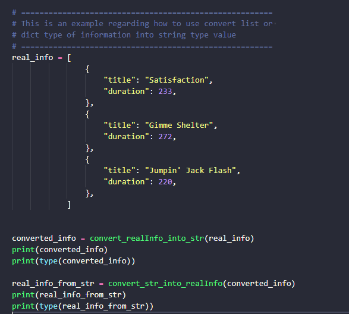
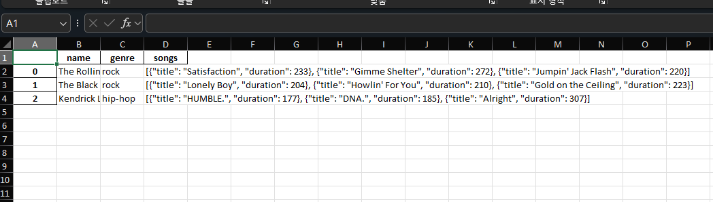

# 01 Assignment

- Q1. Design and Create `Concert database` which is created by using dataframe type of pandas module. Please refer to conditions below
    - when it comes to `saving songs` ( list type ) of each band in dataframe, please refer to an example which is described in attached python file
        - 
    - please fill in `the function (save_information_into_database)` of `ConcertInfoController Class`
    
```python
concert_info = {
                "name": "Rockin' Road Trip",
                "location": "New York City",
                "date": "July 4, 2023",
                "bands":
                    [
                        {
                            "name": "The Rolling Stones",
                            "genre": "rock",
                            "songs":
                                [
                                    {
                                        "title": "Satisfaction",
                                        "duration": 233,
                                    },
                                    {
                                        "title": "Gimme Shelter",
                                        "duration": 272,
                                    },
                                    {
                                        "title": "Jumpin' Jack Flash",
                                        "duration": 220,
                                    },
                                ],
                        },
                        {
                            "name": "The Black Keys",
                            "genre": "rock",
                            "songs":
                                [
                                    {
                                        "title": "Lonely Boy",
                                        "duration": 204,
                                    },
                                    {
                                        "title": "Howlin' For You",
                                        "duration": 210,
                                    },
                                    {
                                        "title": "Gold on the Ceiling",
                                        "duration": 223,
                                    },
                                ],
                        },
                        {
                            "name": "Kendrick Lamar",
                            "genre": "hip-hop",
                            "songs":
                                    [
                                        {
                                            "title": "HUMBLE.",
                                            "duration": 177,
                                        },
                                        {
                                            "title": "DNA.",
                                            "duration": 185,
                                        },
                                        {
                                            "title": "Alright",
                                            "duration": 307,
                                        },
                                ],
                        },
                    ],
                }


class ConcertInfoController():
    def __init__(self, _name, _location, _date, _bands):
        self.name       = _name
        self.location   = _location
        self.date       = _date
        self.bands      = _bands

    def save_information_into_database(self):
        """
        1. convert list type of bands information into dataframe type of bands information
        2. and then save it in excel file or other file format
        """
        pass

```

| name | genre | songs |
| ---- | ----- | ----- |
| The Rolling Stones | rock | [{'title': 'Satisfaction', 'duration': 233}, {'title': 'Gimme Shelter', 'duration': 272}, {'title': "Jumpin' Jack Flash", 'duration': 220}] |
| The Black Keys | rock | [{'title': 'Lonely Boy', 'duration': 204}, {'title': "Howlin' For You", 'duration': 210}, {'title': 'Gold on the Ceiling', 'duration': 223}] | 
| Kendrick Lamar | hip-hop | [{'title': 'HUMBLE.', 'duration': 177}, {'title': 'DNA.', 'duration': 185}, {'title': 'Alright', 'duration': 307}] |


