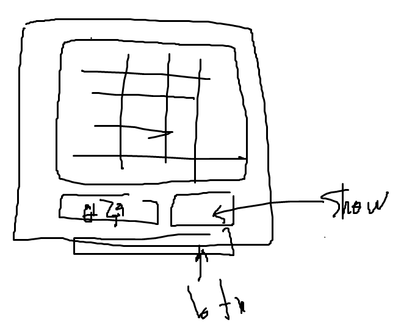

# Tool name
- Database displayer

# Features of Tool
- 데이터베이스 정보 추출
    - 데이터베이스가 저장되어있는데, 툴이 show 되었을때, 데이터 베이스 내용을 display 시키기
- 원하는 정보 검색
    - 검색기능 : 사용자의 각 cell의 값에 따라서 그 cell이 포함된 row 출력하는 기능
<!-- - 데이터베이스 수정 및 보완
    - 사용자 input을 입력받아 database에 반영 -->

